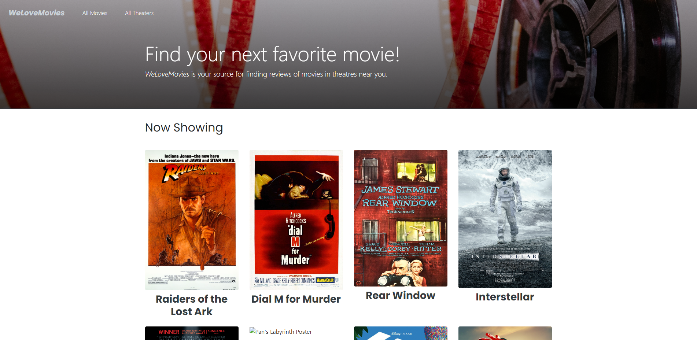

# WeLoveMoviesThinkful
The back end server for the Movie theater application.

## Front End Example

## Deployed Back End
- [Server](https://joelrobinson-movieapp.onrender.com/movies)

## Available Routes
### These routes can be used with the front end to request all movies, theaters, and reviews.
This API can be accessed via:
- /movies
- /:movieId
- /:movieId/Theaters
- /:movieId/revies
- /theaters
- /:reviewId

 ### Built with:
 #### PERN
 - PostgreSQL
 - Express
 - REACT
 - Node.js
 #### As well as
 - Knex
 - CORS
